# **Traffic Sign Recognition** 

## Writeup

---

**Build a Traffic Sign Recognition Project**

The goals / steps of this project are the following:
* Load the data set (see below for links to the project data set)
* Explore, summarize and visualize the data set
* Design, train and test a model architecture
* Use the model to make predictions on new images
* Analyze the softmax probabilities of the new images
* Summarize the results with a written report

---
### Writeup / README

#### 1. Provide a Writeup / README that includes all the rubric points and how you addressed each one. You can submit your writeup as markdown or pdf. You can use this template as a guide for writing the report. The submission includes the project code.

You're reading it! and here is a link to my [project code](https://github.com/vincentekt/CarND-Traffic-Sign-Classifier-Project/blob/master/Traffic_Sign_Classifier.ipynb)

### Data Set Summary & Exploration

#### 1. Provide a basic summary of the data set. In the code, the analysis should be done using python, numpy and/or pandas methods rather than hardcoding results manually.

I used the pandas library to calculate summary statistics of the traffic
signs data set:

* The size of training set is 34799
* The size of the validation set is 4410
* The size of test set is 12630
* The shape of a traffic sign image is (32, 32, 3)
* The number of unique classes/labels in the data set is 43

#### 2. Include an exploratory visualization of the dataset.

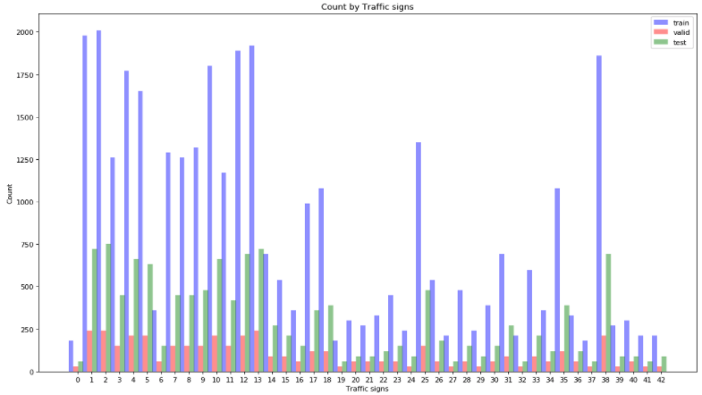

From the graph above, it can be seen that there’s a very uneven distribution of classes acrosss different sets of data. 
This is detrimental towards the learning. Simple quick-fixes like upscaling and downscaling could be applied to mitigate
 this. Image augmentation can also be put into place, instead of upscaling and downscaling.

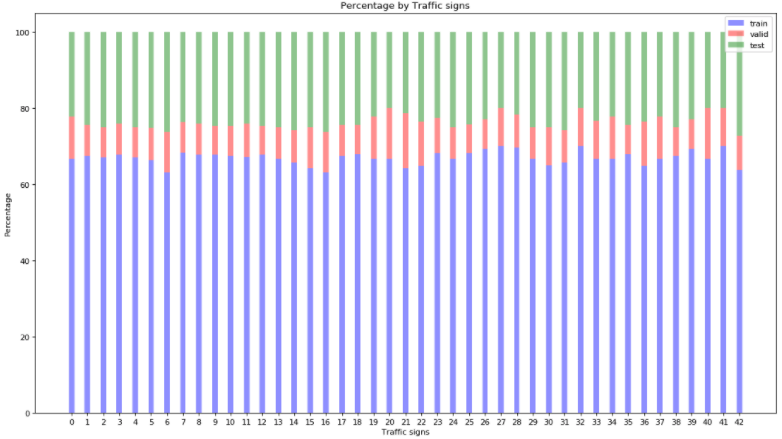

From the graph above we can see that, the composition of different classes across different sets of data, i.e.: train, 
valid and test. Since the composition ratio is quite consistent across different classes, the validation and test 
accuracies can rightfully translates into the quality of learning done by the model.

### Design and Test a Model Architecture

#### 1. Describe how you preprocessed the image data. What techniques were chosen and why did you choose these techniques? Consider including images showing the output of each preprocessing technique. Pre-processing refers to techniques such as converting to grayscale, normalization, etc. (OPTIONAL: As described in the "Stand Out Suggestions" part of the rubric, if you generated additional data for training, describe why you decided to generate additional data, how you generated the data, and provide example images of the additional data. Then describe the characteristics of the augmented training set like number of images in the set, number of images for each class, etc.)

A sample image

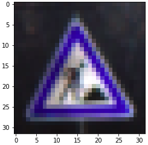

As a first step, I decided to augment the image with difference scale, angle, brightness, to allow the CNN to learn to 
be more tolerant towards them. For every training image, there will be 2 random augmented images created, tripling the 
training data size.

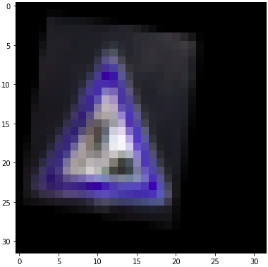
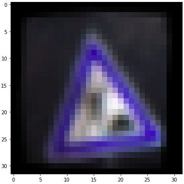

After that, I performed gray-scaling because it would reduce computations by a factor of 3. This is definitely desirable
 but it could adversely affect the model's performance. I have tested and found that with the current model, both the 
 RGB and gray-scale are very close in terms of the models resultant performance. Apart from that, I reckon 'gray-scale 
 models' is applicable to LIDAR where RGB info is not available. 

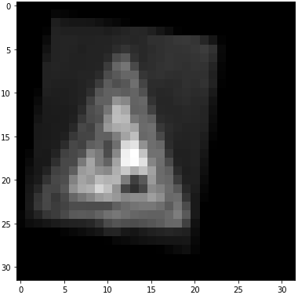
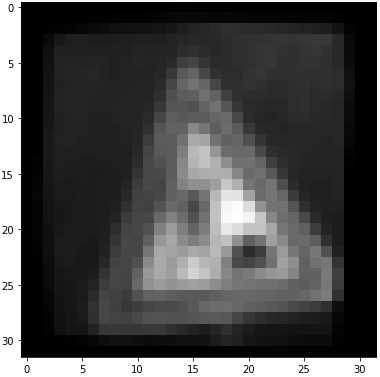

As a last step, I normalized the image data because that would remove the effect of brightness.

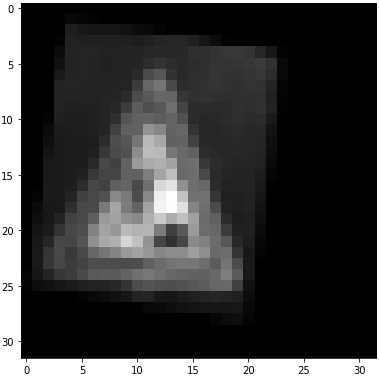

 

Now the size of new training set is 34799 X 3 = 104397. 

#### 2. Describe what your final model architecture looks like including model type, layers, layer sizes, connectivity, etc.) Consider including a diagram and/or table describing the final model.

My final model consisted of the following layers:

| Name        | Layer        	      |     Description	        				     | 
|:-----------:|:---------------------:|:--------------------------------------------:| 
| Input       | Input         	      | 32x32x1 RGB image   						 | 
|             | Convolution 3x3       | 1x1 stride, valid padding, outputs 30x30x8   |
| Conv-Pool 1 | RELU				  |											     |
|             | Max pooling 3x3	      | 1x1 stride, valid padding, outputs 28x28x8   |
|             |                       |											     |
|             | Convolution 3x3       | 1x1 stride, valid padding, outputs 26x26x16  |
| Conv-Pool 2 | RELU			      |											     |
|             | Max pooling 3x3       | 1x1 stride, valid padding, outputs 24x24x16  |
|             |                       |											     |
|             | Convolution 3x3       | 1x1 stride, valid padding, outputs 22x22x32  |
| Conv-Pool 3 | RELU			      |											     |
|             | Max pooling 3x3       | 1x1 stride, valid padding, outputs 20x20x32  |
|             |                       |											     |
|             | Convolution 3x3       | 1x1 stride, valid padding, outputs 18x18x64  |
| Conv-Pool 4 | RELU			      |											     |
|             | Max pooling 3x3       | 1x1 stride, valid padding, outputs 16x16x64  |
|             |                       |											     |
|             | Convolution 3x3       | 1x1 stride, valid padding, outputs 14x14x128 |
| Conv-Pool 5 | RELU			      |											     |
|             | Max pooling 3x3       | 1x1 stride, valid padding, outputs 12x12x128 |
|             |                       |											     |
|             | Convolution 3x3       | 1x1 stride, valid padding, outputs 10x10x256 |
| Conv-Pool 6 | RELU	              |											     |
|             | Max pooling 3x3	      | 1x1 stride, valid padding, outputs 8x8x256   |
|             |                       |											     |
|             | Average Pooling 8x8   | 1x1 stride, valid padding, outputs 1x256     | 
|             | Fully connected	      | weights 256x43        					     |
|   Output    | Softmax				  |         								     |

 

#### 3. Describe how you trained your model. The discussion can include the type of optimizer, the batch size, number of epochs and any hyperparameters such as learning rate.

ANSWER ( Model Training ): The model was trained in mini batches. Size of the batch affects how fast the model learn to 
generalize. Batch size of 200 was used and the results has shown that it has enabled to model to learn enough within the
 first 20 epochs. The epoch was set to 40 even though the validation accuracy has plateaud at around epoch 30. 
 AdamOptimizer was used because of its adaptive nature of the learning rate to moment of gradient which allows the model
  to learn to settle at a more precise global minima of error.

#### 4. Describe the approach taken for finding a solution and getting the validation set accuracy to be at least 0.93. Include in the discussion the results on the training, validation and test sets and where in the code these were calculated. Your approach may have been an iterative process, in which case, outline the steps you took to get to the final solution and why you chose those steps. Perhaps your solution involved an already well known implementation or architecture. In this case, discuss why you think the architecture is suitable for the current problem.

My final model results were:
* training set accuracy of 98.7%
* validation set accuracy of 98.7% 
* test set accuracy of 96.2%

An iterative approach was chosen. At first I tried out LeNet 5 and it didn't give good results. It's a well known 
architecture which successfully classified MNIST dataset. The problem with the architecture however was the lack of 
non-linearity (Depth, underfitting). MNIST dataset required a less complicated modelling capacity because:

1. MNIST dataset is captured or at least adjusted to be from a fixed viewing angle and rotation. 
2. There are only 10 classes.
3. MNIST dataset is gray-scale, with high contrast between important pixels and unimpotant pixels

Meanwhile the Traffic Signs dataset:

1. Captured at different angles, rotations and lighting conditions.
2. There are 43 classes.
3. RGB. Contrast between important pixels and unimportant pixels could be low.

Hence more layers was added to the original model and Global Average Pooling (GAP) was used prior to Fully Connected 
(FC) layers to reduce the number of FC required. That has also reduced a lot of the units needed for the FC layers. The
number of filters for the first layer has been increased from 6 to 8 as the Traffic Signs dataset has more information
within each picture. On top of that, both the first Convolution and Max-Pooling kernel size was decreased from 5X5 to 
3X3 for the same reason. Usually dropout would be put into place to avoid overfitting however the proposed model didn't 
overfit considering the training accuracy being the same as validation accuracy.

### Test a Model on New Images

#### 1. Choose five German traffic signs found on the web and provide them in the report. For each image, discuss what quality or qualities might be difficult to classify.

Here are seven German traffic signs that I found on the web:

| No. | Image			                  |     Label	        	| Real World   | Challenges                 |          
|:---:|:---------------------------------:|:-----------------------:|:------------:|:--------------------------:| 
|  1  | 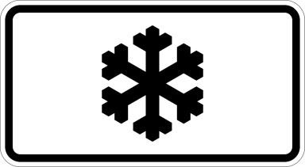   | Beware of ice/snow   	| No           | Deprecated, not real world |
|  2  | 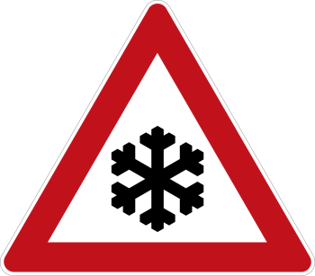    | Beware of ice/snow   	| No           | Not real world        |
|  3  | 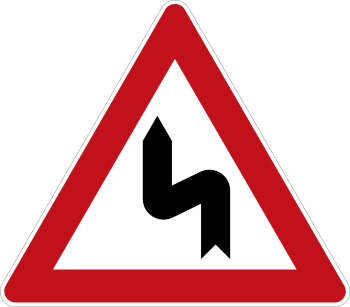    | Double curve   			| No           | Not real world        |
|  4  | 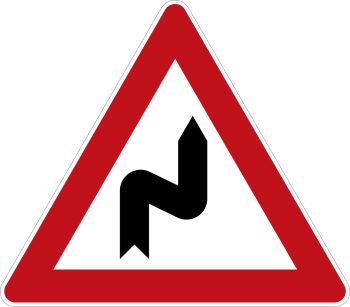    | Double curve   			| No           | Not real world        |
|  5  | 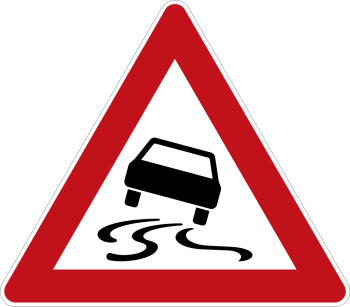       | Slippery road 			| No           | Not real world        |
|  6  |     | Turn left ahead			| No           | Not real world        |
|  7  |        | Turn right ahead   		| No           | Not real world        |
|  8  | 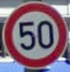       | Speed limit (50km/h)    | Yes          | Rotation                   |
|  9  | 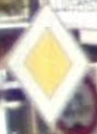      | Priority road			| Yes          | Background sign            |
|  10 | 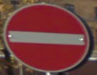      | No entry    			| Yes          | Skewed                     |
|  11 | 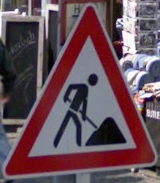      | Road work       		| Yes          | Rotation and Angle         |
|  12 | 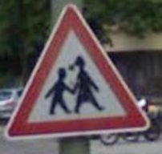      | Children crossing  		| Yes          | Rotation and Angle         |
|  13 | 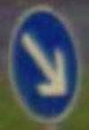      | Keep right   	    	| Yes          | Blurry                     |
|  14 | 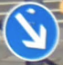      | Keep right   		    | Yes          | Reflection                 | 

#### 2. Discuss the model's predictions on these new traffic signs and compare the results to predicting on the test set. At a minimum, discuss what the predictions were, the accuracy on these new predictions, and compare the accuracy to the accuracy on the test set (OPTIONAL: Discuss the results in more detail as described in the "Stand Out Suggestions" part of the rubric).

Here are the results of the prediction:

| No. |     Label	        	| Prediction              | Correct         |
|:---:|:-----------------------:|:-----------------------:|:-----------------------:| 
|  1  | Beware of ice/snow   	| General caution           | False
|  2  | Beware of ice/snow   	| Beware of ice/snow   	| True
|  3  | Double curve   			| Double curve   		  | True
|  4  | Double curve   			| Children crossing  		| False
|  5  | Slippery road 			| Slippery road 			| True
|  6  | Turn left ahead			| Turn left ahead           | True 
|  7  | Turn right ahead   		| Turn right ahead           | True
|  8  | Speed limit (50km/h)    | Speed limit (50km/h)    | True
|  9  | Priority road			| Priority road			  | True
|  10 | No entry    			| No entry    			  | True
|  11 | Road work       		| Road work       		| True
|  12 | Children crossing  		| Right-of-way at the next intersection          | False
|  13 | Keep right   	    	| Keep right          | True
|  14 | Keep right   		    | Keep right          | True

The accuracy is 11/14, 78.6% meanwhile the previous test accuracy is 96.2%. However, if we consider only those real 
 world images for the new test dataset, the accuracy would be around 6/7, 85.7%. Since the new test dataset is very 
 small, it's hard to judge if the value reflects the actual performance of the model. Probably we should have collected 
 more data, according to the distribution of classes as seen above up until the swapping of one image in the new test 
  dataset doesn't affect the test accuracies by more than 5% ( statistical significance ), i.e.: 
   
   1. **BEFORE** swapping of 1 image in the new test dataset: Test accuracy = 78.6%.
   2. **AFTER** swapping of 1 image in the new test dataset: Test accuracy = 78.6 +/- 3.93%.

It would be even better if the new test dataset collected fulfills the above condition at class level:

1. Test accuracy for 'Double curve' **BEFORE** swapping 1 of 'Double curve' test images: Class test accuracy = 70%.
2. Test accuracy for 'Double curve' **AFTER** swapping 1 of 'Double curve' test images: Class test accuracy = 70% +/- 3.5%.

Else the test accuracy for the new test dataset could hardly tell the fitness of the model.

#### 3. Describe how certain the model is when predicting on each of the five new images by looking at the softmax probabilities for each prediction. Provide the top 5 softmax probabilities for each image along with the sign type of each probability. (OPTIONAL: as described in the "Stand Out Suggestions" part of the rubric, visualizations can also be provided such as bar charts)

**Image 1:** 'Beware of ice/snow' (deprecated) 

Jupyter Notebook: In [143]

| Probability         	|     Prediction	        					| 
|:---------------------:|:---------------------------------------------:| 
| 1.0         			| General caution   						    | 
| 1.8569302e-12         | Road work 								    |
| 8.613189e-13		    | Double curve									|
| 5.729566e-15	      	| Traffic signals					 			|
| 7.6942236e-23		    | Double curve      							|

The model was very confident that 'General caution' was the true class. Although the sign is deprecated, the model 
 should have learned the most important part of the image, i.e.: the snow flake as the strongest feature.
 
**Image 2:** 'Beware of ice/snow' 

Jupyter Notebook: In [142]

| Probability         	| Prediction	        					| 
|:---------------------:|:-----------------------------------------:| 
| 0.6557469             | Beware of ice/snow                            |
| 0.34425312            | Children crossing                             |
| 4.1773996e-15         | Priority road                                 |
| 5.729585e-19          | No entry                                      |
| 1.0070002e-20         | Right-of-way at the next intersection         |

The model wasn't very confident that 'Beware of ice/snow' was the true class. Comparing it to the second guess, it is 
obvious that 'Children crossing' shared the same image structure and colours. The only difference is the object in the 
 center of the sign.

**Image 3:** 'Double curve' (To the left) 

Jupyter Notebook: In [137]

| Probability         	|     Prediction	        					| 
|:---------------------:|:---------------------------------------------:|
| 0.9606061 | Double curve |
| 0.03939386 | General caution |
| 1.0644796e-14 | Right-of-way at the next intersection |
| 9.820929e-16 | Road work |
| 1.8361316e-19 | Pedestrians |

The model was very confident that 'Double curve' was the true class. Considering the argument of the previous image,
this 'Double curve' shared the same image structure and colours as well, that could lead to the idea of both the center
 piece of 'Beware of ice/snow' and 'Children crossing' are too complicated for the model to differentiate them apart. 
  Their details are rather fine compared to this 'Double curve'. Increasing resolution could probably help in this 
   situation.

**Image 4:** 'Double curve' (To the right) 

 Jupyter Notebook: In [138]
 
| Probability         	|     Prediction	        					| 
|:---------------------:|:---------------------------------------------:|
| 1.0 | Children crossing |
| 4.9661765e-29 | End of no passing |
| 7.083955e-30 | Slippery road |
| 0.0 | Speed limit (20km/h) |
| 0.0 | Speed limit (30km/h) |

The model was very confident that 'Children crossing' was the true class. This could mean the 'Double curve' data in the
training set consists of only 'To the left' 'Double curve's.

**Image 5:** 'Slippery road' 

Jupyter Notebook: In [139]

| Probability         	|     Prediction	        					| 
|:---------------------:|:---------------------------------------------:|
| 1.0                   | Slippery road                                 |
| 2.2579543e-18         | Dangerous curve to the left                   |
| 0.0                   | Speed limit (20km/h) |
| 0.0                   | Speed limit (30km/h) |
| 0.0                   | Speed limit (50km/h) |

The model was very confident that 'Slippery road' was the true class. 

**Image 6:** 'Turn left ahead'

Jupyter Notebook: In [145]

| Probability         	|     Prediction	        					| 
|:---------------------:|:---------------------------------------------:|
| 1.0 | Turn left ahead |
| 2.9165532e-18 | Speed limit (30km/h) |
| 7.199597e-24 | Go straight or left |
| 6.7414707e-25 | Speed limit (120km/h) |
| 6.004801e-25 | Ahead only |

The model was very confident that 'Turn left ahead' was the true class. 

**Image 7:** 'Turn right ahead'

Jupyter Notebook: In [144]

| Probability         	|     Prediction	        					| 
|:---------------------:|:---------------------------------------------:|
| 1.0 | Turn right ahead |
| 5.2271904e-14 | No passing for vehicles over 3.5 metric tons |
| 5.0213628e-14 | Speed limit (80km/h) |
| 1.5075945e-14 | End of speed limit (80km/h) |
| 6.534013e-16 | Keep right |

The model was very confident that 'Turn right ahead' was the true class. 

**Image 8:** 'Speed limit (50km/h)'

Jupyter Notebook: In [136]

| Probability         	|     Prediction	        					| 
|:---------------------:|:---------------------------------------------:|
| 0.99993277 | Speed limit (50km/h) |
| 6.72002e-05 | Turn right ahead |
| 5.8023075e-09 | Double curve |
| 2.928046e-10 | Keep right |
| 4.0121188e-12 | Speed limit (100km/h) |

The model was very confident that 'Speed limit (50km/h)' was the true class. 

**Image 9:** 'Priority road'

Jupyter Notebook: In [134]

| Probability         	|     Prediction	        					| 
|:---------------------:|:---------------------------------------------:|
| 1.0 | Priority road |
| 4.9302482e-17 | Right-of-way at the next intersection |
| 4.4080806e-17 | Yield |
| 6.008488e-18 | Roundabout mandatory |
| 1.8831832e-18 | No entry |

The model was very confident that 'Priority' was the true class. 

**Image 10:** 'No entry'

Jupyter Notebook: In [135]

| Probability         	|     Prediction	        					| 
|:---------------------:|:---------------------------------------------:|
| 0.9999949 | No entry |
| 1.1653664e-06 | Yield |
| 1.0045809e-06 | Priority road |
| 7.1067103e-07 | No passing |
| 5.895509e-07 | Keep right |

The model was very confident that 'No entry' was the true class.
 
**Image 11:** 'Road work'
 
Jupyter Notebook: In [140]
 
| Probability         	|     Prediction	        					| 
|:---------------------:|:---------------------------------------------:|
| 1.0 | Road work |
| 1.6606891e-15 | General caution |
| 2.5242018e-25 | Children crossing |
| 2.4939813e-28 | Traffic signals |
| 1.4051093e-29 | Right-of-way at the next intersection |

The model was very confident that 'Road work' was the true class.

**Image 12:** 'Children crossing'

Jupyter Notebook: In [141]

| Probability         	|     Prediction	        					| 
|:---------------------:|:---------------------------------------------:|
| 0.9915577 | Right-of-way at the next intersection |
| 0.006384874 | Pedestrians |
| 0.0020573698 | Children crossing |
| 8.830755e-10 | Road work |
| 1.1653421e-12 | No passing for vehicles over 3.5 metric tons |

The model was very confident that 'Right-of-way at the next intersection' was the true class. Like what was mentioned 
for **Image 2** apart from 'Right-of-way at the next intersection' sharing similar image structure and colours, it has 
 solid clutter(s) in the middle of the sign, common to 'Children crossing' and 'Beware of ice/snow'. 

**Image 13:** 'Keep right' (Skewed)

Jupyter Notebook: In [146]

| Probability         	|     Prediction	        					| 
|:---------------------:|:---------------------------------------------:|
| 1.0 | Keep right |
| 6.5232904e-20 | Road work |
| 4.0460092e-24 | Bumpy road |
| 3.9658156e-24 | Priority road |
| 3.6998298e-26 | Wild animals crossing |

The model was very confident that 'Keep right' was the true class.

**Image 14:** 'Keep right'

Jupyter Notebook: In [147]

| Probability         	|     Prediction	        					| 
|:---------------------:|:---------------------------------------------:|
| 1.0 | Keep right |
| 9.806732e-31 | Road narrows on the right |
| 3.6239985e-31 | Road work |
| 2.6332396e-32 | Ahead only |
| 1.444339e-32 | Priority road |

The model was very confident that 'Keep right' was the true class.

### (Optional) Visualizing the Neural Network (See Step 4 of the Ipython notebook for more details)
#### 1. Discuss the visual output of your trained network's feature maps. What characteristics did the neural network use to make classifications?

**Image 9:** 'Priority road'

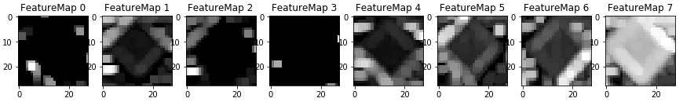

The model used the the frame as the main feature.

**Image 2:** 'Beware of ice/snow' 

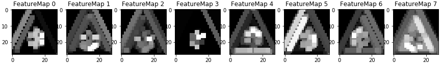

Apart from using both the frame and central piece of the image as features, it also uses the space between the frame and
 central piece of the image as feature.

**Image 1:** 'Beware of ice/snow' (Deprecated)

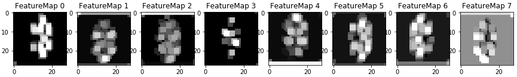

The model couldn't detect the frame here, hence it used only the central piece of the image as features.